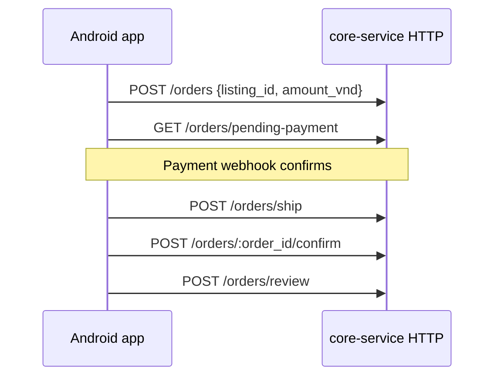
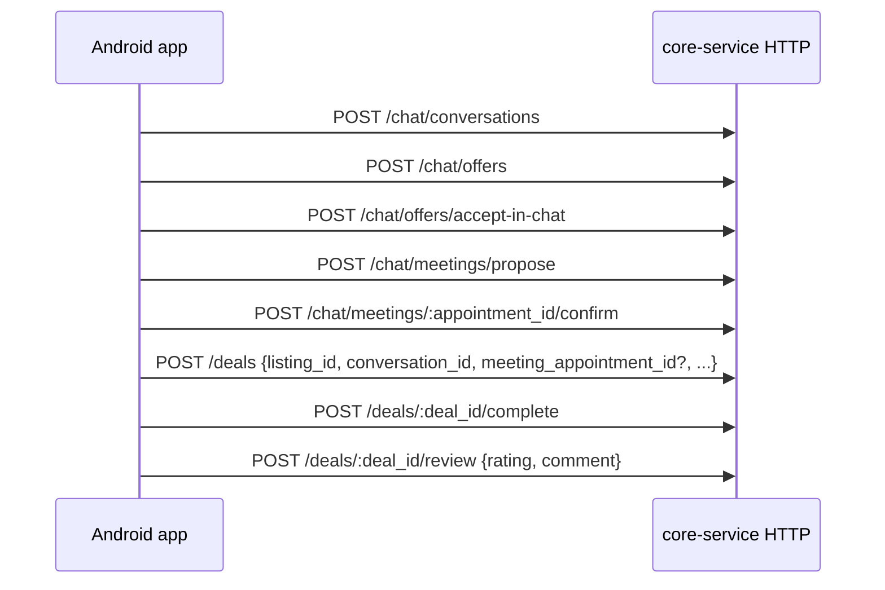
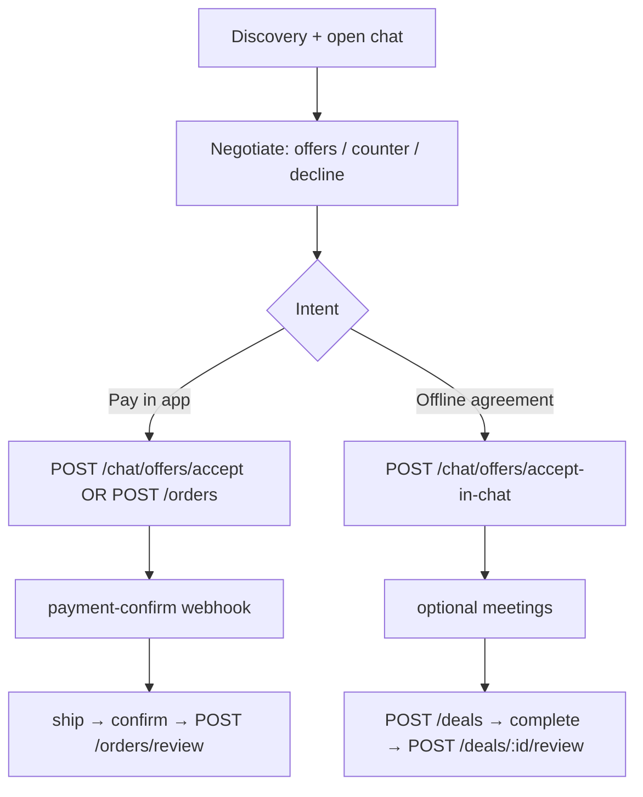

# Android — end-to-end business API flow (core-service)

This document describes **HTTP APIs only** (what the Android app calls), in **call order** for the main commerce journeys: discovery → chat → negotiate price → optional meeting → **either** in-app checkout (orders) **or** C2C/offline (deals) → finish → **star rating** (reviews).

**Android UI/UX must implement these journeys** — see **§7** for the full mapping (screens, CTAs, build flags, and QA checklist).

For realtime (WebSocket/Kafka) and push contracts, see `integration-realtime.md`, `presence-fcm-contract.md`, and `android-notifications.md`.

---

## 1. Conventions (read first)

### 1.1 Base URL and locale

Routes are registered under:

- **Localized:** `/{lang}{APP_API_PREFIX}/v1/...` where `lang` is `en` or `vi`
- **Legacy (no segment):** `{APP_API_PREFIX}/v1/...` (locale defaults to `en`)

Default in `.env.example`: `APP_API_PREFIX=/api` → example:

| Variant | Example |
|--------|---------|
| Localized | `https://<host>/en/api/v1/...` or `/vi/api/v1/...` |
| Legacy | `https://<host>/api/v1/...` |

If the gateway uses `APP_PUBLIC_PREFIX` (e.g. `/core-service`), the same paths are mounted under that prefix (see `routes.go`).

### 1.2 Authentication

Protected routes require:

```http
Authorization: Bearer <access_token>
```

Token extraction follows RFC 6750 (`Bearer ` prefix). Refresh via `POST /auth/refresh` when the access token expires.

### 1.3 Checkout feature flag

`ORDER_CHECKOUT_ENABLED` (default `true` in `.env.example`):

- When **false**: `POST /orders`, `POST /chat/offers/accept` (seller accept → creates order), and payment webhook behavior are disabled per product rules; C2C paths (`accept-in-chat`, deals) are used instead.

**Android alignment:** There is no runtime fetch of this flag today. Match server behavior per environment using **`CHAT_USE_SOFT_OFFER_ACCEPT`** (`env/*.env` → `BuildConfig`): when **`true`**, seller accept uses **`POST /chat/offers/accept-in-chat`** (Flow C branch); when **`false`**, seller accept uses **`POST /chat/offers/accept`** (Flow A escrow order). Keep dev/prod env files consistent with core-service `ORDER_CHECKOUT_ENABLED` so UI copy and CTAs (e.g. “Pay now” vs offline/deal) match what the API allows.

---

## 2. API inventory (by domain)

Below, `{v1}` means `{APP_API_PREFIX}/v1` (e.g. `/api/v1`). All paths are relative to `/{lang}` when using localized URLs.

### 2.1 Auth (public + protected)

| Step | Method | Path | Auth |
|------|--------|------|------|
| Login | `POST` | `{v1}/auth/login` | No |
| Refresh | `POST` | `{v1}/auth/refresh` | No |
| Social login | `POST` | `{v1}/auth/social-login` | No |
| OTP request | `POST` | `{v1}/auth/otp/request` | No |
| OTP verify | `POST` | `{v1}/auth/otp/verify` | No |
| Logout | `POST` | `{v1}/auth/logout` | Bearer |
| Logout all | `POST` | `{v1}/auth/logout-all` | Bearer |
| FCM register | `POST` | `{v1}/auth/fcm/register` | Bearer |

### 2.2 User (typical before checkout)

| Step | Method | Path | Auth |
|------|--------|------|------|
| Onboard | `POST` | `{v1}/users/onboard` | Bearer |
| Me | `GET` / `PATCH` | `{v1}/users/me` | Bearer |
| Shipping addresses | `GET` / `POST` | `{v1}/users/me/shipping-addresses` | Bearer |
| Set default address | `PATCH` | `{v1}/users/me/shipping-addresses/:addr_id/default` | Bearer |
| Public profile | `GET` | `{v1}/users/:id` | Optional Bearer |
| Suggested username | `GET` | `{v1}/users/suggested-username` | No |

### 2.3 Discovery (listings & search)

| Step | Method | Path | Auth |
|------|--------|------|------|
| Home feed | `GET` | `{v1}/listings/home` | Bearer |
| Listing detail | `GET` | `{v1}/listings/:listing_id` | Optional Bearer |
| Seller listings | `GET` | `{v1}/users/:id/listings` | Optional Bearer |
| Search listings | `GET` | `{v1}/search/listings` | Bearer |
| Autocomplete | `GET` | `{v1}/search/autocomplete` | Bearer |
| Featured sellers | `GET` | `{v1}/search/featured-sellers` | Bearer |
| Record view | `POST` | `{v1}/listings/:listing_id/view` | Bearer |
| Like / save | `POST` | `{v1}/listings/:listing_id/like` / `.../save` | Bearer |

### 2.4 Chat — thread & messages

| Step | Method | Path | Auth |
|------|--------|------|------|
| Start conversation | `POST` | `{v1}/chat/conversations` | Bearer |
| List conversations | `GET` | `{v1}/chat/conversations` | Bearer |
| Conversation detail | `GET` | `{v1}/chat/conversations/:conversation_id` | Bearer |
| Mark read | `POST` | `{v1}/chat/conversations/:conversation_id/read` | Bearer |
| List messages | `GET` | `{v1}/chat/conversations/:conversation_id/messages` | Bearer |
| Send message | `POST` | `{v1}/chat/messages` | Bearer |
| Delete message | `DELETE` | `{v1}/chat/messages/:message_id` | Bearer |
| Unread count | `GET` | `{v1}/chat/unread` | Bearer |

**Request JSON (examples):**

- Start: `{ "listing_id": "<uuid>" }`
- Send message: `{ "conversation_id": "<uuid>", "content": "..." }`

### 2.5 Chat — offers (deal price in chat)

| Step | Method | Path | Auth | Notes |
|------|--------|------|------|--------|
| Send offer (buyer) | `POST` | `{v1}/chat/offers` | Bearer | Body: `conversation_id`, `amount_vnd` (≥ 1000) |
| Seller accept → **creates order** | `POST` | `{v1}/chat/offers/accept` | Bearer | `conversation_id`, `offer_message_id`. **Disabled when checkout off.** |
| Accept in chat only (no order) | `POST` | `{v1}/chat/offers/accept-in-chat` | Bearer | Same body as accept; C2C agreement |
| Counter (seller) | `POST` | `{v1}/chat/offers/counter` | Bearer | `conversation_id`, `buyer_offer_message_id`, `amount_vnd` |
| Decline | `POST` | `{v1}/chat/offers/decline` | Bearer | `conversation_id`, `offer_message_id` |

### 2.6 Chat — meetings (appointments)

| Step | Method | Path | Auth |
|------|--------|------|------|
| Propose meeting | `POST` | `{v1}/chat/meetings/propose` | Bearer |
| Confirm | `POST` | `{v1}/chat/meetings/:appointment_id/confirm` | Bearer |
| Cancel | `POST` | `{v1}/chat/meetings/:appointment_id/cancel` | Bearer |

**Propose body (fields):** `conversation_id`, `location_url`, `scheduled_at` (RFC3339), optional `reminder_enabled`, `reminder_offset_minutes`.

### 2.7 Orders (in-app checkout)

| Step | Method | Path | Auth |
|------|--------|------|------|
| Create order (checkout) | `POST` | `{v1}/orders` | Bearer |
| My orders | `GET` | `{v1}/orders` | Bearer |
| Pending payment | `GET` | `{v1}/orders/pending-payment` | Bearer |
| Order detail | `GET` | `{v1}/orders/:order_id` | Bearer |
| Cancel unpaid order (buyer) | `POST` | `{v1}/orders/:order_id/cancel` | Bearer |
| **Payment webhook** | `POST` | `{v1}/orders/:order_id/payment-confirm` | **Server-to-server** (not user JWT) |
| Ship (seller) | `POST` | `{v1}/orders/ship` | Bearer |
| Confirm received (buyer) | `POST` | `{v1}/orders/:order_id/confirm` | Bearer |
| Review (1–5 stars) | `POST` | `{v1}/orders/review` | Bearer |
| Open dispute | `POST` | `{v1}/orders/dispute` | Bearer |
| Dispute evidence | `POST` | `{v1}/orders/dispute/evidence` | Bearer |

**Create order body:** `{ "listing_id": "<uuid>", "amount_vnd": <int> }`

**Review body:** `{ "order_id": "<uuid>", "rating": 1-5, "comment": "..." }`

### 2.8 Deals (C2C / offline log)

| Step | Method | Path | Auth |
|------|--------|------|------|
| Create deal | `POST` | `{v1}/deals` | Bearer |
| Complete | `POST` | `{v1}/deals/:deal_id/complete` | Bearer |
| Cancel | `POST` | `{v1}/deals/:deal_id/cancel` | Bearer |
| Review (1–5 stars) | `POST` | `{v1}/deals/:deal_id/review` | Bearer |

**Create deal body:** `listing_id`, `conversation_id`, optional `meeting_appointment_id` (must be **confirmed** if set), `agreed_price`, `meeting_location_url`, `meeting_at` (RFC3339).

---

## 3. End-to-end flows (diagrams)

### 3.1 Flow A — In-app checkout (offers → order → pay → ship → confirm → review)

Use when `ORDER_CHECKOUT_ENABLED=true` and you want payment + shipping inside the app.

```mermaid
sequenceDiagram
  participant App as Android app
  participant API as core-service HTTP

  App->>API: GET /listings/:id (optional JWT)
  App->>API: POST /chat/conversations {listing_id}
  App->>API: POST /chat/messages (chat)
  App->>API: POST /chat/offers {conversation_id, amount_vnd}
  Note over App,API: Seller accepts → creates order + links conversation
  App->>API: POST /chat/offers/accept {conversation_id, offer_message_id}
  App->>API: GET /orders/pending-payment
  Note over App,API: Client opens PSP; PSP calls webhook
  App->>API: POST /orders/:order_id/payment-confirm (payment service, not app)
  App->>API: GET /orders/:order_id
  App->>API: POST /orders/ship {order_id, tracking_number, carrier}
  App->>API: POST /orders/:order_id/confirm
  App->>API: POST /orders/review {order_id, rating, comment}
```

**API-by-api (happy path, minimal):**

1. `GET /api/v1/listings/:listing_id` — show item.
2. `POST /api/v1/chat/conversations` — open thread for that listing.
3. `POST /api/v1/chat/messages` — optional chat.
4. `POST /api/v1/chat/offers` — buyer price offer.
5. `POST /api/v1/chat/offers/accept` — seller accepts → **order created**; store `order_id` from response payload / subsequent `GET` conversations or orders.
6. `GET /api/v1/orders/pending-payment` — show pay CTA for buyer.
7. Buyer pays via external checkout; **payment service** calls `POST /api/v1/orders/:order_id/payment-confirm`.
8. `GET /api/v1/orders/:order_id` — poll or refresh after payment until status allows ship.
9. `POST /api/v1/orders/ship` — seller ships.
10. `POST /api/v1/orders/:order_id/confirm` — buyer confirms receipt.
11. `POST /api/v1/orders/review` — **stars** + comment.

### 3.2 Flow B — Direct checkout (no offer accept)

Buyer buys at a chosen amount without going through offer accept:



**API-by-api:**

1. `POST /api/v1/orders` — creates checkout order (requires checkout enabled).
2. `GET /api/v1/orders/pending-payment` / `GET /api/v1/orders/:order_id`.
3. `POST /api/v1/orders/:order_id/payment-confirm` (PSP).
4. `POST /api/v1/orders/ship` → `POST /api/v1/orders/:order_id/confirm` → `POST /api/v1/orders/review`.

### 3.3 Flow C — C2C: accept in chat + meeting + deal + complete + deal review

Use when settling offline or when checkout is disabled for offer-accept paths.



**API-by-api:**

1. `POST /api/v1/chat/conversations`
2. `POST /api/v1/chat/offers`
3. `POST /api/v1/chat/offers/accept-in-chat` — agreement **without** order.
4. `POST /api/v1/chat/meetings/propose` — optional but common for meetups.
5. `POST /api/v1/chat/meetings/:appointment_id/confirm`
6. `POST /api/v1/deals` — log agreed price + time/place; optional link to confirmed appointment.
7. `POST /api/v1/deals/:deal_id/complete`
8. `POST /api/v1/deals/:deal_id/review` — **stars** for deal flow.

### 3.4 Flow map — when to branch



---

## 4. After order cancel (buyer, unpaid)

`POST /orders/:order_id/cancel` applies to buyer orders in **`payment_pending`** (online escrow) or **`cash_meetup_open`** (cash / meetup). Works even when checkout is disabled server-side. On success: order → **cancelled**, listing → **active**, conversation `order_id` cleared, other chats **reopened**. Android: `OrderBuyerCancelPolicy`, `OrderRepository.cancelOrder`, UI on order detail / chat fulfillment / ship flow / checkout.

Then the app may call again:

- `POST /chat/offers` (and related offer endpoints),
- `POST /chat/meetings/propose`,
- `POST /deals`,

subject to normal rules (e.g. conversation not closed, listing active for offers).

---

## 5. Related docs in this repo

| Topic | File |
|-------|------|
| Chat | `integration-chat.md` |
| Orders | `order-api-integration.md` |
| Listings (Android) | `android-listings-api.md` |
| Search (Android) | `search-api-android.md` |
| Shipping addresses | `android-shipping-addresses-api.md` |
| Full-stack Android prompt | `integration-android-fullstack.md` |
| C2C / meetings / deals spec | `C2C_CHAT_MEETINGS_DEALS_CHANGELOG_SPEC.md` |
| **Android UI/UX ↔ APIs (screens, flags, QA)** | **This document §7** |

---

## 6. Swagger

When enabled (non-production + `SWAGGER_ENABLE`), OpenAPI UI is at `/docs/index.html` on the service (and under `APP_PUBLIC_PREFIX` if set). Use it for exact schemas and try-it-out URLs.

---

## 7. Android UI/UX compliance (this repo)

This section ties **§2–§4** to **concrete screens and behaviors** so product and engineering can verify the app matches the business flows above.

### 7.1 Global conventions (must comply with §1)

| Topic | Document | Android implementation |
|--------|----------|-------------------------|
| Base URL + locale | §1.1 | `AppEnvironment.apiBaseUrl`, `AppLocale` / localized paths via shared API client |
| Bearer auth | §1.2 | Session + `Authorization` on authenticated calls; refresh handled in auth layer |
| Checkout vs C2C | §1.3 | **`BusinessFlowConfig.useSoftOfferAccept`** (`env/*.env` → `BuildConfig.CHAT_USE_SOFT_OFFER_ACCEPT`; see `config/BusinessFlowConfig.kt`, `app/build.gradle.kts`) |
| Max offers per thread | §2.5 | **`BusinessFlowConfig.maxOffersPerConversation`** (same env / `BuildConfig.CHAT_MAX_OFFERS_PER_CONVERSATION`) |

### 7.2 Domain → primary UI surfaces (§2 inventory)

| §2 | Domain | Primary user surfaces | Repository / VM (indicative) |
|----|--------|----------------------|------------------------------|
| 2.1 | Auth | `LoginScreen`, `OtpVerifyScreen`, session in `MainActivity` | Auth / `LoginViewModel` |
| 2.2 | User | `OnboardingScreen`, `EditProfileScreen`, `AddEditAddressScreen`, `ShippingAddressListScreen` | `UserRepository`, profile / address VMs |
| 2.3 | Discovery | Home feed, Explore, `ProductDetailScreen`, search / featured sellers | `HomeViewModel`, `ExploreViewModel`, `ProductDetailViewModel`, search APIs per `search-api-android.md` |
| 2.4 | Chat thread | Inbox, `ChatDetailScreen`, messages, delete | `ChatViewModel`, `ChatDetailViewModel`, `ChatRepository` |
| 2.5 | Offers | Offer bubbles, buyer offer sheet, seller accept/decline/**counter** | `ChatDetailScreen`, `ChatDetailViewModel`, `ChatRepository` (`/offers`, `/accept` vs `/accept-in-chat`, `/counter`, `/decline`) |
| 2.6 | Meetings | `MeetingProposalBottomSheet`, meeting proposal / confirm / cancel in thread | `ChatRepository`, `MeetingUi.kt`, `ChatDetailViewModel` |
| 2.7 | Orders | `OrdersScreen`, `OrderDetailScreen`, `CheckoutScreen`, `PendingPaymentBanner`, ship / confirm / **review** / **dispute** | `OrderRepository`, `OrderDetailViewModel`, `CheckoutViewModel`, `PendingPaymentViewModel` |
| 2.8 | Deals | Offline deal sheet, deal banner, complete / cancel / **deal review** | `DealRepository`, `ChatDetailViewModel`, `ChatDetailScreen` |

### 7.3 End-to-end flows §3 — Android entry points

| Flow | When (server + product) | Android UX summary |
|------|-------------------------|-------------------|
| **§3.1 Flow A** | Escrow checkout enabled; seller accept **creates order** | PDP/chat → offers → **`POST /chat/offers/accept`** when `CHAT_USE_SOFT_OFFER_ACCEPT == false` → linked `order_id` → **DealBanner** / pending payment → **`CheckoutScreen`** (pay) → order detail timeline → seller **ship** → buyer **confirm** → **`POST /orders/review`** from order detail when eligible |
| **§3.2 Flow B** | Direct buy without offer accept | PDP **Buy now** / create order path → **`POST /orders`** → same checkout + order detail surfaces as A after order exists |
| **§3.3 Flow C** | Offline / checkout disabled for accept | Offers → **`POST /chat/offers/accept-in-chat`** when `CHAT_USE_SOFT_OFFER_ACCEPT == true` → **no** escrow “Pay now” for that path; optional **meetings** → **`POST /deals`** → complete → **`POST /deals/:id/review`** (deal review sheet / flow in chat) |

**Branch diagram §3.4:** The app must not show **in-app checkout** as the primary path when the build is on **soft accept** (C2C): copy and banners follow `C2C_CHAT_MEETINGS_DEALS_CHANGELOG_SPEC.md` and `ChatDetailScreen` / `DealBanner` rules.

### 7.4 §4 After buyer cancel (unpaid)

| Server behavior | Expected Android UX |
|-----------------|---------------------|
| Conversation–order link cleared; listing active; chat reopened | After **`POST /orders/:order_id/cancel`**, refresh conversation + order state; **offer** and **meeting** / **deal** flows available again when rules allow |
| Implementation | `CheckoutViewModel` / `OrderCancelCoordinator`; chat `ChatDetailViewModel` keeps thread + listing context; user can send offers and open meeting/deal UI per §4 |

### 7.5 UX rules (must not contradict §2–§4)

1. **Ratings:** Escrow orders → **`POST /orders/review`** from **order detail** when status allows. C2C deals → **`POST /deals/:id/review`** from the **deal** completion/review UX in chat — do not send users to the wrong review endpoint for the path they used.
2. **Payments:** Checkout and PSP handoff only where **`POST /orders`** / payment pipeline applies; do not label a C2C-only thread as “paid in app” when `accept-in-chat` was used.
3. **Errors:** API failures for any of the above endpoints should surface with clear copy (snackbar / dialog); success messages that are informational use the global dialog host pattern consistently.
4. **Discoverability:** Orders list and order detail remain the hub for **ship / confirm / dispute / order review**; chat remains the hub for **offers, meetings, offline deals, deal review**.

### 7.6 QA checklist (release)

Use this list against a build whose **`CHAT_USE_SOFT_OFFER_ACCEPT`** matches the target server:

- [ ] **Discovery:** open listing from home/explore/search; optional like/save/view per §2.3.
- [ ] **Chat:** start or open thread; send messages; mark read; unread badge updates.
- [ ] **Offers:** buyer sends offer; seller counter / decline; seller accept uses **accept** vs **accept-in-chat** per build flag; offer limits respected.
- [ ] **Flow A/B:** create or land on order → pending payment → checkout → payment confirmed (poll/refresh) → seller ship → buyer confirm → **star review** on order.
- [ ] **Flow C (if enabled):** accept-in-chat → propose/confirm meeting → create deal → complete → **deal star review**.
- [ ] **Cancel unpaid order:** buyer cancels from checkout path; thread allows offers/meetings/deals again per §4.
- [ ] **Dispute:** open dispute and optional evidence when order state allows (§2.7).

### 7.7 Related implementation docs

| Topic | File |
|-------|------|
| C2C env flag and changelog | `C2C_CHAT_MEETINGS_DEALS_CHANGELOG_SPEC.md` |
| Chat API details | `integration-chat.md` |
| Orders | `order-api-integration.md` |

---
