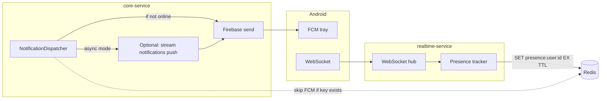

# Notification integration: core-service + realtime-service + Android

This document covers **only the push-notification path**: Firebase (FCM), Redis presence (so users online on WebSocket do not get duplicate tray pushes), optional async delivery, and what the Android app must do. It does **not** cover general REST, orders, or chat persistence.

---

## 1. How it works (one picture)

**Rule:** While `presence:user:{user_id}` exists in Redis, **core-service does not send FCM** for that user (realtime is expected to deliver in-app). Realtime **writes** that key; core **reads** it.

---

## 2. core-service (notifications)

| Piece | Location / behavior |
|-------|---------------------|
| Send path | `internal/infrastructure/notification/dispatcher.go` — title/body to FCM; **skips** if `PresenceChecker` sees `presence:user:{id}`. |
| Presence read | `internal/infrastructure/presence/presence_checker.go` — `Exists` on `presence:user:{user_id}`. |
| Device tokens | `POST /api/v1/auth/fcm/register` — body: `fcm_token` (required), `device_platform` (optional). See `internal/delivery/http/requests/auth/fcm_register.request.go`. |
| Firebase | `GOOGLE_APPLICATION_CREDENTIALS` — path to service account JSON. If unset, FCM is disabled (log-only). |
| Async queue (optional) | `NOTIFICATION_PUSH_ASYNC=true` → enqueue to Redis Stream **`stream:notifications:push`**. In-process worker: `internal/infrastructure/notification/push_queue_worker.go`, started from `internal/infrastructure/jobs/notification_jobs.go`. Worker **re-checks presence** before send. |
| Config | `internal/config/notification.config.go` — `NOTIFICATION_PUSH_ASYNC`. Optional `PUSH_QUEUE_CONSUMER_NAME`. |

**Stream note:** `stream:notifications:push` is **only** for core’s FCM worker. Realtime-service must **not** subscribe to it.

---

## 3. realtime-service (notifications)

| Piece | Location / behavior |
|-------|---------------------|
| Presence write | `internal/presence/tracker.go` — `SET presence:user:{user_id} 1 EX <TTL>`; `DEL` when last socket for user closes. |
| TTL | **`WS_PRESENCE_TTL`** (e.g. `300s`). Default **300s**. Must stay **above** your client ping interval (e.g. ping every ~30s). |
| Refresh key | On first WS connection; on each JSON **`{"type":"ping"}`**; on each WebSocket **pong**. See `internal/hub/pump.go`, `internal/hub/hub.go`. |
| WebSocket URL | `GET /ws?token=<access_jwt>&platform=android` — same JWT family as core (issuer + secret must match). |

Realtime does **not** send FCM; it only maintains presence so core can suppress pushes.

---

## 4. Shared deployment (notifications)

| Must match | core-service | realtime-service |
|------------|--------------|------------------|
| Redis | `REDIS_HOST`, `REDIS_PORT`, `REDIS_PASSWORD`, **`REDIS_DB`** | Same |
| JWT for WebSocket | `APP_NAME` → token `iss` | `JWT_ISSUER` / `JWT_ALLOWED_ISSUERS` includes that `iss` |
| HS256 secret | `ACCESS_TOKEN_SECRET` | Same value |

If Redis or JWT differ, presence will be wrong and users may get **duplicate** (FCM + in-app) or **missing** pushes.

---

## 5. Android (notification-specific)

1. **FCM:** Add Firebase; after login call **`POST /api/v1/auth/fcm/register`** with the current token; on **`onNewToken`**, register again.
2. **Presence (avoid duplicate tray):** Connect WebSocket to realtime with the **same access token** as REST. Send **`{"type":"ping"}`** about every **30s** (see `integration-realtime.md` §2.7). Keep connection while the app should be treated as “online.”
3. **Foreground:** If the chat UI already shows the message from WebSocket, **do not** show a second heads-up from FCM.
4. **Channels:** Use notification channels (`chat`, `orders`, …) on Android 8+.
5. **Deep links:** Today payloads are mainly title/body; extend server later with **data** fields if you need tap-to-screen IDs.

Logout: core invalidates session-scoped FCM tokens as implemented in logout flow; re-register after next login.

---

## 6. Environment variables (notifications only)

**core-service**

| Variable | Purpose |
|----------|---------|
| `GOOGLE_APPLICATION_CREDENTIALS` | Firebase service account JSON path |
| `REDIS_*` | Same Redis as realtime |
| `NOTIFICATION_PUSH_ASYNC` | `true` = use `stream:notifications:push` + worker |
| `PUSH_QUEUE_CONSUMER_NAME` | Optional consumer name for async worker |

**realtime-service**

| Variable | Purpose |
|----------|---------|
| `WS_PRESENCE_TTL` | e.g. `300s` — TTL of `presence:user:{id}` |
| `REDIS_*` | Same as core |
| `JWT_ISSUER` / `JWT_ALLOWED_ISSUERS` / `ACCESS_TOKEN_SECRET` | Must validate the same tokens as core |

---

## 7. Quick verification (notifications)

- [ ] With **WebSocket connected** + **ping** running, new events should **not** spam FCM for the same user (presence key set).
- [ ] With **app killed** or **WS disconnected**, FCM should still arrive if `fcm_token` is registered.
- [ ] Redis **DB index** identical on core and realtime.

---

## 8. More detail (same repo)

| Doc | Content |
|-----|---------|
| [presence-fcm-contract.md](presence-fcm-contract.md) | Operator troubleshooting, key semantics |
| [android-notifications.md](android-notifications.md) | Android checklist (duplicate of §5 with extra notes) |
| [integration-realtime.md](integration-realtime.md) | WebSocket frames, `ping` / `pong`, full stream list for **in-app** events |

Realtime repo: **`INTEGRATION.md`** §0.1 — FCM coordination summary.

---

## 9. Android app (this repository)

| Item | Implementation |
|------|----------------|
| FCM registration | `FcmTokenRegistrar` → `AuthRepository.registerFcm` after login (`MainActivity` `LaunchedEffect(isAuthenticated)`). |
| Token refresh | `FashFirebaseMessagingService.onNewToken` → same registrar. |
| Presence / ping | Every **30s**, if WebSocket is **CONNECTED**, `RealtimeManager.sendPing()` (`{"type":"ping"}`). |
| Duplicate tray (foreground) | If **ProcessLifecycleOwner** is started **and** `RealtimeManager` is **CONNECTED**, incoming FCM messages **do not** post a notification (belt-and-suspenders with Redis presence). |
| Channels | `FashNotificationChannels`: `fash_chat`, `fash_orders`, `fash_general` (see `strings.xml` labels). |
| Android 13+ | `POST_NOTIFICATIONS` requested when the user signs in. |
| Firebase config | Replace **`app/google-services.json`** with the file from Firebase Console (add both `com.pc.fash_android_mobile` and `com.pc.fash_android_mobile.dev` apps, or one project with two Android clients). The committed file is a **placeholder** so CI/build works until you add real keys. |
